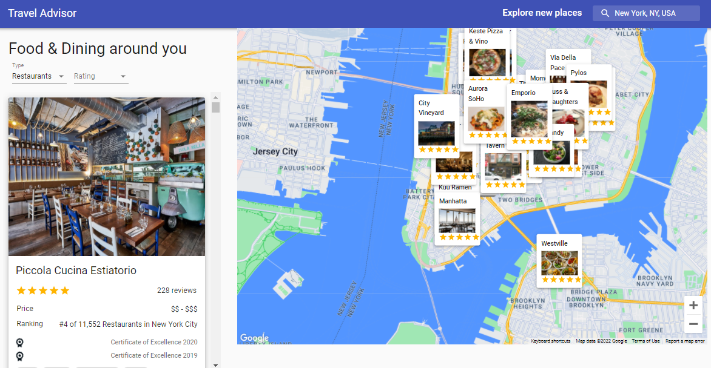

## Demo

[View live project](https://travel-advisor-red.vercel.app/)

## Description

This is a travel advisor app that allows users to explore restaurants, hotels, and attractions based on user's current city. You can also use the search bar or drag over the map to explore any city in the world. Users can get useful info like weather forcasts, ratings, cuisines, addresses, phone numbers, etc.
Note that you have to grant location access on your device in order to use this app.

## Tech Stack

- [React JS](https://reactjs.org/) - For frontend.
- [Material UI](https://mui.com/) - For UI components and styling.
- [Google Maps API](https://www.google.com/maps/) - For maps functionality.
- [Google Places API](https://developers.google.com/maps/documentation/places/web-service/overview) - For searching cities in the world.
- [Travel Advisor API](https://rapidapi.com/apidojo/api/travel-advisor/) - For Places data
- [Open Weather Map API](https://rapidapi.com/community/api/open-weather-map/) - For weather data.
